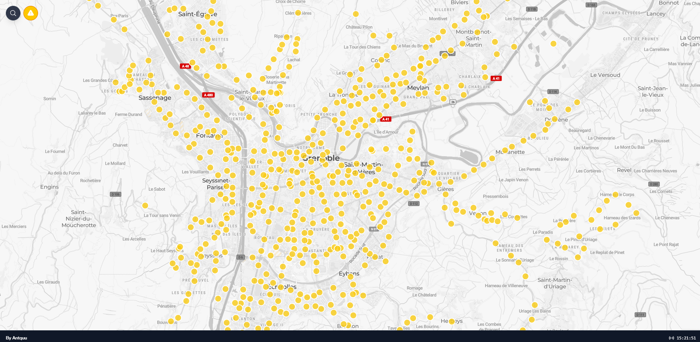
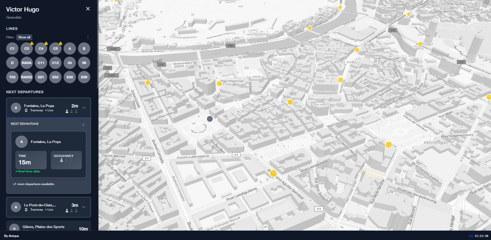
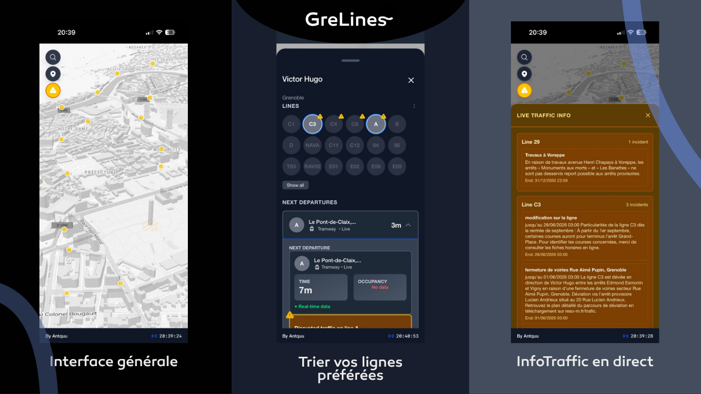

[](https://grelines.vercel.app/)

[](https://reactjs.org/)
[](https://vitejs.dev/)
[](https://tailwindcss.com/)
[](https://www.typescriptlang.org/)
[](https://www.framer.com/motion/)
[](https://leafletjs.com/)
[](https://www.maptiler.com/)

> Une application web React moderne pour visualiser les arrêts de transport public de Grenoble avec des informations de départ en temps réel, utilisant Mapbox.

## 📸 Captures d'écran

### Interface principale

*Carte interactive avec les arrêts de transport marqués.*

### Sidebar des détails

*Overlay animé affichant les détails de l'arrêt et les prochains départs.*

### Vue mobile



## ✨ Fonctionnalités

- 🗺️ **Intégration Mapbox** avec Mapbox GL JS
- 🚌 **Informations d'arrêts en temps réel** via l'API MTAG
- 🎯 **Sidebar animée** glissant depuis la gauche
- 📱 **Carte en plein écran** avec overlay (pas côte à côte)
- 🎨 **Design inspiré du transit** (style MBTA)
- 🚀 **Développement rapide** avec Vite
- 🌙 **Support du mode sombre**
- ⚡ **Design responsive** et optimisé

## 🛠️ Pile technologique

- **Framework Frontend**: React 18 avec TypeScript
- **Outil de build**: Vite
- **Stylisation**: Tailwind CSS
- **Cartes**: Leaflet avec tuiles MapTiler
- **Animations**: Framer Motion
- **Appels API**: Axios
- **Police**: Helvetica/Polices système

## 📁 Structure du projet

```
src/
├── components/          # Composants React
│   ├── Map.tsx         # Composant Mapbox
│   ├── Sidebar.tsx     # Sidebar overlay animée
│   └── index.ts        # Exports des composants
├── services/           # Services API
│   └── api.ts          # Intégration API MTAG + données mock
├── types/              # Types TypeScript
│   └── index.ts        # Définitions des types
├── App.tsx             # Composant principal
├── main.tsx            # Point d'entrée
└── index.css           # Styles globaux avec Tailwind

public/                 # Assets statiques
```

## 🚀 Démarrage rapide

### Prérequis

- Node.js 16+ et npm/yarn

### Installation et développement

1. **Installer les dépendances** (déjà fait dans la configuration initiale)

2. **Démarrer le serveur de développement**:
   ```bash
   npm run dev
   ```

3. **Ouvrir** [http://localhost:5173](http://localhost:5173) dans votre navigateur

### Build pour la production

```bash
npm run build
```

## 🌐 Configuration MapTiler

La carte utilise MapTiler avec une clé gratuite (100k tuiles/mois). La configuration est déjà intégrée dans le code avec votre clé personnelle.

Si vous voulez changer de style MapTiler :
1. Choisissez un style sur [MapTiler](https://www.maptiler.com/)
2. Remplacez le `MAPTILER_STYLE_ID` dans `src/components/Map.tsx`

## 🔌 Intégration API

L'application utilise l'API MTAG (Mobilités Métropolitaines) :
- **URL de base** : `https://data.mobilites-m.fr/donnees`

Actuellement utilisant des **données mock** pour la démonstration. Pour intégrer des données réelles :

1. Mettre à jour les appels API dans `src/services/api.ts`
2. Remplacer les données mock par les vrais endpoints API
3. Adapter les types dans `src/types/index.ts` si nécessaire

## 🏗️ Architecture

### Stratégie de layout
- **Carte** : Plein écran (z-index: 0)
- **Header** : Fixé en haut à gauche avec ombre (z-index: 30)
- **Sidebar** : Overlay animé depuis la gauche, glisse sur la carte (z-index: 40)
- **Backdrop mobile** : Overlay assombri quand sidebar ouverte (z-index: 20)

Cela permet à la carte d'être toujours visible pendant que les détails glissent par-dessus.

### Fonctionnalités en détail

#### Carte Mapbox interactive
- Affiche tous les arrêts de transport de Grenoble
- Marqueurs jaunes pour les arrêts réguliers
- Marqueur bleu pour l'arrêt sélectionné
- Clic sur le marqueur pour voir les détails

#### Sidebar des détails d'arrêt
- Glisse depuis la gauche avec animation fluide
- Affiche le nom et la localisation de l'arrêt
- Liste toutes les lignes desservant l'arrêt
- Affiche les prochains départs avec compteurs
- Indicateurs de statut en temps réel
- Bouton de fermeture tactile

#### Design responsive
- Approche mobile-first
- Sidebar superposée sur tous les écrans
- Interface tactile
- Support du mode sombre

## 💻 Développement

### Scripts disponibles

- `npm run dev` - Démarre le serveur de développement
- `npm run build` - Build pour la production
- `npm run preview` - Aperçu du build de production
- `npm run lint` - Lance ESLint

### Fichiers clés à modifier

**Pour ajouter l'intégration API réelle :**
- `src/services/api.ts` - Remplacer les données mock par des appels API réels

**Pour personnaliser la carte :**
- `src/components/Map.tsx` - Ajuster la configuration Leaflet et les tuiles MapTiler

**Pour personnaliser l'apparence de la sidebar :**
- `src/components/Sidebar.tsx` - Modifier les styles et la disposition

**Pour ajouter de nouvelles informations d'arrêt :**
- `src/types/index.ts` - Étendre les définitions d'interfaces

## 🌍 Support des navigateurs

- Chrome/Edge 88+
- Firefox 85+
- Safari 14+
- Leaflet supporté sur tous les navigateurs modernes

## 📄 Licence

Licence MIT - libre d'utilisation pour vos projets

## 🆘 Support

Pour les problèmes ou questions concernant Leaflet ou MapTiler, consultez :
- [Documentation Leaflet](https://leafletjs.com/)
- [Documentation MapTiler](https://docs.maptiler.com/)
- [Documentation API MTAG](https://data.mobilites-m.fr/donnees)
```
