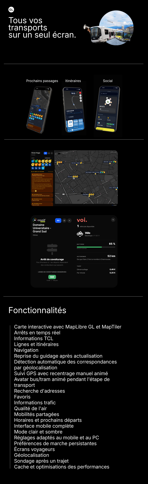

[](https://grelines.fr/)

[](https://grelines.fr/fr/newsroom)

* **Version** : `3.7.0`
* **Principales nouveautés** :

  * Vitrine publique sur `/fr` et `/en`
  * Documentation complète sur `/fr/docs`, en trois étages
  * Pages de solutions sur `/fr/solutions/<nom>`
  * Salle de presse sur `/fr/newsroom`
  * Page de licence sur `/fr/legals/license`
  * Passage de la GPL v3 à l'AGPL v3, avec conditions d'attribution
  * Section « Dernières actualités » en page d'accueil
  * En-tête réduit à la pastille, sans le nom écrit à côté
  * Historique des arrêts limité à quatre entrées sur mobile
  * Résultats d'itinéraire remis à zéro à la fermeture de la feuille
  * Carte MapLibre
  * Arrêts en temps réel
  * TCL
  * Lignes et itinéraires
  * Navigation
  * Reprise de l'étape active après actualisation de la page
  * Détection de la correspondance et du véhicule par géolocalisation
  * Recentrage manuel animé sans recentrage permanent à l'arrêt
  * Marqueur de position transformé en avatar bus ou tram avec fondu
  * Recherche d’adresses
  * Favoris
  * Trafic
  * Qualité de l’air
  * Mobilités partagées
  * Horaires
  * Interface mobile complète
  * Mode clair/sombre
  * Contrastes et boutons corrigés pour le mode clair
  * Préférences de marche et de vitesse conservées localement
  * Réglages de compte et notifications réservés au mobile
  * Écrans voyageurs
  * Géolocalisation
  * Sondage trajet
  * Cache et optimisation

[](https://grelines.fr/fr/docs/deploy)

* **Framework Frontend** : React 19 avec TypeScript en mode strict
* **Outil de build** : Vite 8
* **Stylisation** : Tailwind CSS 4, complété de feuilles écrites à la main
* **Cartes** : MapLibre GL avec tuiles MapTiler
* **Animations** : Framer Motion
* **Appels API** : Axios
* **Base de données** : Supabase (PostgreSQL), interrogée depuis le navigateur
* **Fonctions serveur** : deux fonctions à la demande, pour les fournisseurs qui
  demandent une authentification
* **Hébergement** : dossier statique servi par Vercel
* **Polices** : Inter pour l'application, Geist et Geist Mono pour la vitrine

## Structure du projet

```text
src/
├── components/          # Composants React de l'application
│   ├── Map.tsx          # Composant MapLibre
│   ├── HomeSheet.tsx    # Feuille d'accueil mobile
│   ├── RouteSidebar.tsx # Recherche et résultats d'itinéraires
│   └── index.ts         # Exports des composants
├── landing/             # Le site public, servi sur /fr et /en
│   ├── LandingApp.tsx   # Page d'accueil
│   ├── DocsPage.tsx     # Documentation, sur trois étages
│   ├── SolutionPage.tsx # Les six pages de solutions
│   ├── BlogPage.tsx     # Salle de presse
│   ├── LegalPage.tsx    # Pages légales, licence comprise
│   └── landing.css      # Styles du site public
├── screen/              # GreLines Screen, l'affichage plein écran
├── services/            # Accès aux données
│   ├── api.ts           # Arrêts, passages, itinéraires
│   ├── supabase.ts      # Base de données
│   └── blog.ts          # Communiqués
├── hooks/               # Hooks partagés
├── utils/               # Utilitaires
├── types/               # Définitions TypeScript
├── App.tsx              # Composant principal de l'application
├── main.tsx             # Point d'entrée et routage
└── index.css            # Styles globaux avec Tailwind

api/                     # Fonctions serveur
├── tcl.js               # Réseau lyonnais
└── uber.js              # Estimations VTC

supabase/                # Schéma de la base, un fichier par sujet
public/                  # Assets statiques
```

[](https://grelines.fr/fr/docs/)

[](https://grelines.fr/fr/legals/license)

Copyright © 2026 Antoine ADAM (antquu).

GreLines est distribué sous les termes de la **GNU Affero General Public License v3.0 (AGPL-3.0)**, augmentée de conditions d'attribution autorisées par l'article 7 de cette licence.

**Pourquoi l'Affero et non la GPL ordinaire.** La GPL se déclenche quand on distribue un logiciel. GreLines ne se distribue pas, il s'héberge : sous GPL, quelqu'un pourrait prendre ce code, le mettre en ligne à sa propre adresse, le servir au public et ne jamais rien rendre, puisqu'il n'a remis de copie à personne. L'article 13 de l'AGPL fait compter l'usage en réseau.

Cette licence vous autorise à utiliser, étudier, modifier, redistribuer et héberger le logiciel, y compris à titre professionnel. Elle vous demande trois choses en retour :

1. **Citer l'origine dans le code.** Garder les mentions de droit d'auteur et le fichier de licence, et indiquer dans le fichier de présentation du dépôt que le travail est fondé sur GreLines, avec le lien vers ce dépôt.
2. **Citer l'origine sur le site.** Si vous mettez le projet en ligne pour d'autres, chaque utilisateur doit pouvoir voir une mention nommant GreLines et renvoyant à ce dépôt, sans compte, sans connexion et sans abonnement, sur le premier écran ou dans un pied de page atteignable en un geste.
3. **Ne pas vous faire passer pour l'origine.** Ne pas présenter ce travail comme votre création, ni employer le nom ou le logotype GreLines de façon à laisser croire que votre version est l'officielle. Dire que votre projet est fondé sur GreLines est en revanche encouragé.

**Ce qui compte comme version dérivée.** Un fichier copié d'ici reste un fichier d'ici, qu'il soit renommé, remis en forme, traduit, réorganisé en dossiers, passé dans un transpileur ou réécrit par une machine. Cela vaut pour les composants d'interface comme pour les feuilles de style, les schémas de base et les structures de contenu. En revanche, écrire sa propre application de transport depuis une page blanche, sans copier ce code, n'est pas couvert : le droit d'auteur protège la façon dont ce logiciel est écrit, pas l'idée d'annoncer le prochain tram.

**Usage local et privé.** Aucune de ces obligations ne s'applique quand vous faites tourner le projet pour vous : sur votre machine, sur un serveur chez vous, ou à l'intérieur d'une organisation dont seuls les membres s'en servent. Vous ne remettez de copie à personne et vous ne le mettez à disposition d'aucun tiers. Les obligations commencent au moment où d'autres personnes deviennent utilisatrices de ce que vous faites tourner.

Les éléments qui ne sont pas couverts par cette licence, notamment les données de transport, les logotypes des réseaux desservis, les photographies et les montages du site, restent soumis à leurs propres conditions. La licence ne donne aucun droit sur l'instance exploitée à grelines.fr : ses adresses, ses clés, ses comptes et ses bases ne font pas partie du code publié.

Le logiciel est fourni **sans aucune garantie**, conformément aux conditions de la GNU AGPL v3.

Le texte qui fait foi est le fichier [`LICENSE`](LICENSE) de ce dépôt. Il contient les conditions additionnelles puis le texte intégral de l'AGPL v3. La page [grelines.fr/fr/legals/license](https://grelines.fr/fr/legals/license) l'explique en français ordinaire.

Pour toute question concernant le projet, sa licence ou son utilisation :

**Antoine ADAM**
**GitHub :** [@antquu](https://github.com/antquu)
**Email :** [ant.adam468@gmail.com](mailto:ant.adam468@gmail.com)


---

## Fonctionnalités en détail

### Carte interactive

* Affichage des arrêts de transport
* Affichage des différentes lignes et services
* Sélection d'un arrêt directement depuis la carte
* Affichage des informations associées à chaque arrêt
* Gestion de la position de l'utilisateur
* Recherche et navigation depuis la carte
* Utilisation de MapLibre GL pour le rendu cartographique

### Informations sur les arrêts

* Affichage du nom et de la localisation de l'arrêt
* Liste des lignes desservant l'arrêt
* Prochains départs
* Informations de circulation
* Perturbations associées
* Accès aux horaires détaillés
* Ajout et gestion des favoris

### Lignes et itinéraires

* Consultation des lignes du réseau
* Affichage des informations détaillées d'une ligne
* Visualisation du parcours d'une ligne
* Recherche d'un itinéraire
* Affichage des différentes étapes d'un trajet
* Prévisualisation d'un trajet avant le lancement de la navigation
* Mode navigation
* Remise à zéro complète des résultats à la fermeture de la feuille

### Guidage et géolocalisation

Le guidage conserve désormais sa progression afin de reprendre le bon tronçon
après une actualisation de la page ou une interruption du navigateur.

* Sauvegarde locale de l'itinéraire et de l'étape active
* Détection d'un bus ou d'un tram déjà rejoint après une correspondance
* Passage automatique à l'étape suivante grâce à la position GPS
* Recentrage manuel animé sur la position courante
* Reprise automatique du suivi après une interaction avec la carte
* Marqueur de position transformé progressivement en avatar coloré bus/tram
* Tracé de transport conservé dans la couleur de sa ligne
* Portions à pied et points du trajet toujours visibles

### Réglages et thèmes

Les réglages sont adaptés à l'appareil utilisé et leurs préférences utiles sont
conservées localement.

* Préférences de marche et vitesse enregistrées pour les prochains itinéraires
* Feuille de préférence de marche adaptée aux résultats mobiles
* Contraste corrigé des boutons, titres et sélections en mode clair
* Cartes et groupes de réglages sans fond sombre superflu en mode clair
* Connexion au compte et notifications disponibles uniquement sur mobile
* Interface disponible en français et en anglais

### Recherche

* Recherche d'adresses
* Recherche d'arrêts
* Géocodage
* Accès direct aux arrêts depuis une URL
* Synchronisation de l'état de la recherche avec l'URL
* Interface de recherche adaptée aux appareils mobiles

### Favoris et historique

* Ajout d'un arrêt aux favoris
* Suppression d'un favori
* Affichage des favoris depuis l'interface principale
* Accès rapide aux informations d'un arrêt favori
* Conservation des favoris entre les sessions
* Historique des arrêts consultés, quatre entrées visibles sur mobile

### Trafic et qualité de l'air

* Affichage des informations de trafic
* Association des perturbations avec les arrêts concernés
* Panneau dédié aux informations de circulation
* Affichage des données de qualité de l'air
* Intégration des informations ATMO

### TCL

* Panneau dédié aux informations TCL
* Affichage des informations et avertissements associés au réseau
* Intégration dans l'interface principale
* Adaptation du panneau aux interfaces mobiles

### Mobilités partagées

* Affichage des services de mobilité partagée
* Informations sur les services disponibles
* Affichage des tarifs lorsque les données sont disponibles
* Panneau dédié aux mobilités partagées

### Horaires et écrans voyageurs

* Affichage des prochains départs
* Tableaux horaires
* Informations détaillées sur les départs
* Interface inspirée des écrans d'information voyageurs
* Affichage des lignes et des destinations
* Bandeaux d'informations et éléments défilants

### Site public

* Page d'accueil sur `/fr` et `/en`, sans rien charger de l'application
* Documentation sur trois étages : sommaire, catégorie, article
* Six pages de solutions, une par offre
* Salle de presse et communiqués
* Pages légales, licence comprise
* Thème clair et sombre partagé avec l'application

### Design responsive

* Approche mobile-first
* Interface adaptée aux smartphones, tablettes et ordinateurs
* Panneaux superposés à la carte
* Interactions tactiles
* Recherche mobile dédiée
* Panneaux spécifiques aux petits écrans
* Support du mode clair et du mode sombre

## Développement

### Scripts disponibles

* `npm run dev` - Démarre le serveur de développement sur le port 5173
* `npm run build` - Vérifie les types puis construit le paquet de production
* `npm run preview` - Aperçu du build de production
* `npm run lint` - Lance ESLint sur le dépôt entier

### Adresses en développement

| Adresse | Ce qu'elle sert |
| --- | --- |
| `/` | L'application |
| `/app/screen` | L'affichage plein écran |
| `/fr` | La vitrine |
| `/fr/docs` | La documentation |
| `/fr/solutions/screen` | Une page de solution |
| `/fr/newsroom` | La salle de presse |
| `/fr/legals/license` | La licence |

### Fichiers clés à modifier

**Pour modifier l'intégration API :**

* `src/services/` - Services permettant de récupérer et traiter les données
* `api/` - Fonctions serveur, pour les fournisseurs qui demandent une clé

**Pour personnaliser la carte :**

* `src/components/Map.tsx` - Configuration MapLibre et MapTiler

**Pour personnaliser les sidebars :**

* `src/components/` - Composants des différents panneaux et overlays

**Pour modifier le site public :**

* `src/landing/content.ts` - Les textes de la page d'accueil
* `src/landing/docsContent.ts` - Les textes de la documentation
* `src/landing/solutionsContent.ts` - Les textes des pages de solutions
* `src/landing/legalContent.ts` - Les pages légales et la licence

**Pour ajouter de nouvelles données :**

* `src/types/` - Définitions des interfaces et types TypeScript
* `src/services/` - Services associés aux nouvelles données
* `supabase/` - Schéma, un fichier par sujet

## Support des navigateurs

* Chrome / Edge 88+
* Firefox 85+
* Safari 14+
* Navigateurs modernes compatibles avec MapLibre GL

## Licence

Ce projet est sous licence GNU AGPL v3, augmentée de conditions d'attribution.
Voir [`LICENSE`](LICENSE) et [grelines.fr/fr/legals/license](https://grelines.fr/fr/legals/license).

## Support

Pour les problèmes ou questions concernant les technologies utilisées :

* [Documentation MapLibre GL](https://maplibre.org/)
* [Documentation MapTiler](https://docs.maptiler.com/)
* [Documentation API MTAG](https://data.mobilites-m.fr/donnees)

## Note de mise à jour

### GreLines 3.5 → 3.7

La 3.7 ne change pas l'application : elle lui donne ce qui lui manquait autour.
Jusqu'ici, GreLines n'existait qu'en s'ouvrant. Il n'y avait aucune page à
envoyer à un exploitant, aucune documentation à lire avant de se lancer, et rien
qui dise à quelles conditions on pouvait reprendre le code.

### Le site public

Un site complet est servi sur `/fr` et `/en`, et sur elles seules : `/` continue
de mener droit à l'application. Il ne charge rien de celle-ci, ni carte ni
service d'horaires, parce qu'une page de présentation qui met trois secondes à
s'afficher ne présente rien du tout.

Il comprend une page d'accueil, six pages de solutions, une salle de presse, les
pages légales, et une documentation.

### La documentation

Servie sur `/fr/docs`, en trois étages : le sommaire présente huit catégories,
une catégorie présente ses sections, une section est un article. Une adresse par
sujet, donc un lien qu'on colle dans un message sans avoir à dire où chercher
dans la page.

Trente-trois sections, dont trois nouveautés de fond : comment déployer une
instance à soi, de quoi le produit est fait brique par brique, et comment donner
un retour utile. Les extraits de code y sont réels, tirés du dépôt.

Le sommaire est un accordéon, avec un pictogramme par section et un champ qui le
filtre sans tenir compte des accents.

### Les pages de solutions

Six pages, une par offre, sur `/fr/solutions/<nom>` : GreLines Screen, affiches
et QR codes, messages aux porteurs, retours voyageurs, GreLines Data,
raccordement d'un réseau.

Toutes ont la même charpente, et c'est voulu : six pages qui se ressemblent se
comparent, six pages qui inventent chacune leur plan obligent à réapprendre où
regarder. Douze emplacements d'images par page, tous facultatifs, qui
disparaissent tant que le fichier n'existe pas.

### La licence

Le projet passe de la GPL v3 à l'**AGPL v3**, augmentée de conditions
d'attribution autorisées par l'article 7.

La raison est simple : la GPL se déclenche à la distribution, et GreLines ne se
distribue pas, il s'héberge. Sous GPL, on pouvait reprendre ce code, le mettre
en ligne ailleurs, le servir au public et ne jamais rien rendre. L'article 13 de
l'AGPL fait compter l'usage en réseau.

Les conditions additionnelles demandent de citer l'origine dans le code et sur
le site, visiblement, pour tout utilisateur et sans connexion préalable. Elles
ne s'appliquent pas à un usage local ou privé. Une page publique les explique en
français ordinaire, sur `/fr/legals/license`.

### Corrections d'interface

Deux défauts de longue date ont été corrigés.

Les feuilles de la vitrine se refermaient mal sur leur propre état : la feuille
d'itinéraires n'est jamais démontée une fois ouverte, pour se rouvrir à
l'instant, et ses résultats survivaient à sa fermeture. On revenait donc sur la
liste d'un trajet abandonné, parfois réduite au seul GreLines Trip parce que les
autres sources avaient été vidées entre-temps. Tout est maintenant effacé à la
fermeture, quelle que soit la façon dont on ferme, et les requêtes en vol ne
peuvent plus repeupler une liste qu'on vient de vider.

L'historique de la feuille d'accueil montre quatre arrêts au lieu de huit. On ne
descend pas dans un historique : on y reconnaît son arrêt du premier coup d'oeil,
ou l'on repasse par la recherche.

### Détails d'affichage

* En-tête réduit à la pastille, sans le nom écrit à côté
* Section « Dernières actualités » en page d'accueil, alimentée par la salle de presse
* Pied de page nettoyé des liens qui ne menaient qu'à des écrans mobiles
* Marges des titres réparées sur tout le site public
* En-tête de la vitrine réellement collant en haut de l'écran
