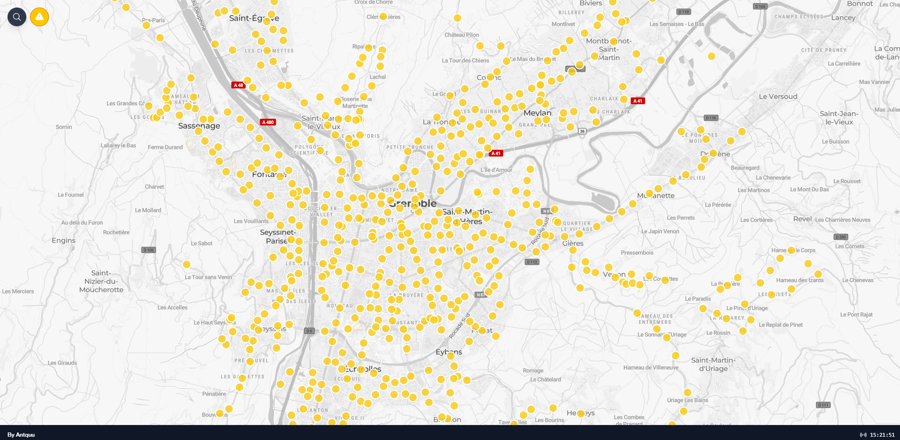
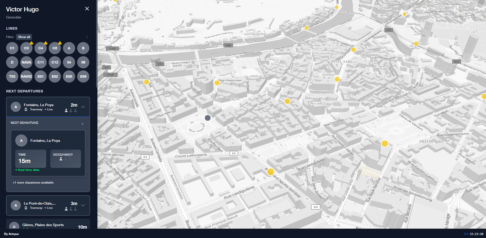
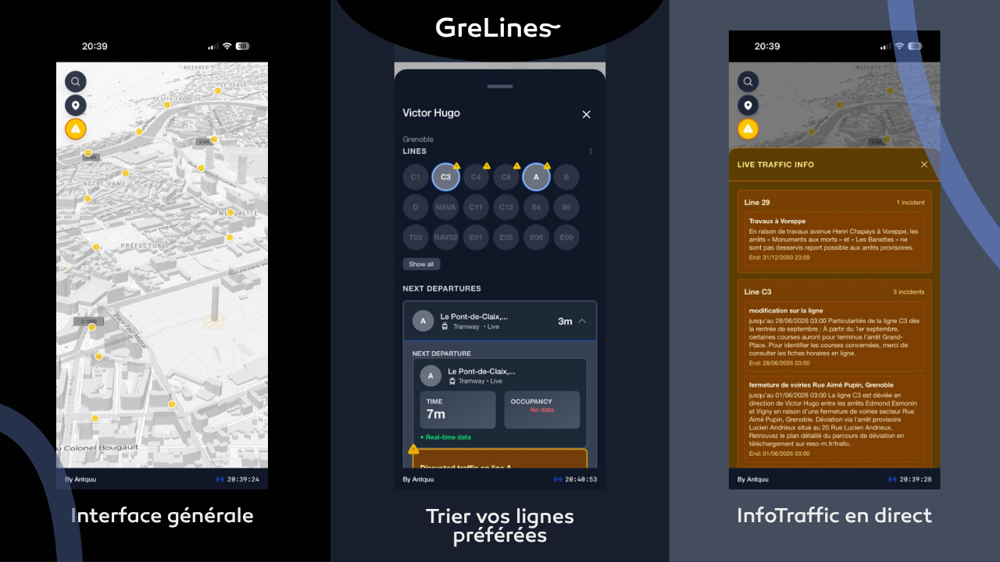

[](https://grelines.vercel.app/)

[](https://reactjs.org/)
[](https://vitejs.dev/)
[](https://tailwindcss.com/)
[](https://www.typescriptlang.org/)
[](https://www.framer.com/motion/)
[](https://maplibre.org/)
[](https://www.maptiler.com/)

> Une application web React moderne pour visualiser les arrêts de transport public de Grenoble avec des informations de départ en temps réel, utilisant MapLibre GL et MapTiler.

## Captures d'écran

### Interface principale

*Carte interactive avec les arrêts de transport marqués.*

### Sidebar des détails

*Overlay animé affichant les détails de l'arrêt et les prochains départs.*

### Vue mobile


## Fonctionnalités

* **Carte interactive** avec MapLibre GL et MapTiler
* **Arrêts en temps réel**
* **Informations TCL**
* **Lignes et itinéraires**
* **Navigation**
* **Recherche d'adresses**
* **Favoris**
* **Informations trafic**
* **Qualité de l'air**
* **Mobilités partagées**
* **Horaires et prochains départs**
* **Interface mobile complète**
* **Mode clair et sombre**
* **Écrans voyageurs**
* **Géolocalisation**
* **Sondage après un trajet**
* **Cache et optimisations des performances**

## Note de mise à jour

* **Version** : `3.2.2`
* **Principales nouveautés** :

  * Carte MapLibre
  * Arrêts en temps réel
  * TCL
  * Lignes et itinéraires
  * Navigation
  * Recherche d’adresses
  * Favoris
  * Trafic
  * Qualité de l’air
  * Mobilités partagées
  * Horaires
  * Interface mobile complète
  * Mode clair/sombre
  * Écrans voyageurs
  * Géolocalisation
  * Sondage trajet
  * Cache et optimisation

## Pile technologique

* **Framework Frontend** : React 19 avec TypeScript
* **Outil de build** : Vite
* **Stylisation** : Tailwind CSS
* **Cartes** : MapLibre GL avec tuiles MapTiler
* **Animations** : Framer Motion
* **Appels API** : Axios
* **Police** : Helvetica / polices système

## Structure du projet

```text
src/
├── components/          # Composants React
│   ├── Map.tsx          # Composant MapLibre
│   ├── Sidebar.tsx      # Sidebar overlay animée
│   └── index.ts         # Exports des composants
├── services/            # Services API
│   └── api.ts           # Intégration API MTAG + données mock
├── types/               # Types TypeScript
│   └── index.ts         # Définitions des types
├── App.tsx              # Composant principal
├── main.tsx             # Point d'entrée
└── index.css            # Styles globaux avec Tailwind

public/                  # Assets statiques
```

## Démarrage rapide

### Prérequis

* Node.js 16+ et npm/yarn

### Installation et développement

1. **Installer les dépendances**

2. **Démarrer le serveur de développement** :

   ```bash
   npm run dev
   ```

3. **Ouvrir** http://localhost:5173 dans votre navigateur

### Build pour la production

```bash
npm run build
```

## Configuration MapTiler

La carte utilise MapTiler avec une clé gratuite.

Si vous souhaitez changer de style MapTiler :

1. Choisissez un style sur [MapTiler](https://www.maptiler.com/)
2. Remplacez l'URL du `mapStyle` dans `src/components/Map.tsx`

## Intégration API

L'application utilise les données du réseau de transport de la métropole :

* **URL de base** : `https://data.mobilites-m.fr/donnees`

Les services de l'application sont organisés afin de gérer les différentes sources de données nécessaires à l'affichage des transports, des horaires, des lignes, du trafic, de la qualité de l'air et des mobilités partagées.

## Architecture

### Stratégie de layout

* **Carte** : plein écran
* **Header** : fixé au-dessus de la carte
* **Sidebars** : overlays animés venant se placer au-dessus de la carte
* **Overlays mobiles** : panneaux adaptés aux interactions tactiles
* **Backdrop mobile** : assombrissement de la carte lorsqu'un panneau est ouvert

Cette architecture permet de conserver la carte visible tout en affichant les différentes informations par-dessus.

## Licence et droits d'auteur

Copyright © 2026 Antoine ADAM (antquu).

GreLines est distribué sous les termes de la **GNU General Public License v3.0 (GPL-3.0)**.

Cette licence vous autorise notamment à utiliser, étudier, modifier et redistribuer le logiciel, sous réserve du respect des conditions définies par la GPL v3.

Le code source de GreLines est fourni sous licence GPL v3. Les éléments qui ne sont pas couverts par cette licence, notamment certains logos, marques, assets graphiques ou contenus appartenant à des tiers, restent soumis à leurs propres conditions d'utilisation.

Le logiciel est fourni **sans aucune garantie**, conformément aux conditions de la GNU GPL v3.

Pour toute question concernant le projet, sa licence ou son utilisation :

**Antoine ADAM**
**GitHub :** [@antquu](https://github.com/antquu)
**Email :** [ant.adam468@gmail.com](mailto:ant.adam468@gmail.com)

Une copie de la GNU GPL v3 doit être fournie avec le projet. La licence complète est disponible sur le site de la Free Software Foundation.


---

## Fonctionnalités en détail

### Carte interactive

* Affichage des arrêts de transport
* Affichage des différentes lignes et services
* Sélection d'un arrêt directement depuis la carte
* Affichage des informations associées à chaque arrêt
* Gestion de la position de l'utilisateur
* Recherche et navigation depuis la carte
* Utilisation de MapLibre GL pour le rendu cartographique

### Informations sur les arrêts

* Affichage du nom et de la localisation de l'arrêt
* Liste des lignes desservant l'arrêt
* Prochains départs
* Informations de circulation
* Perturbations associées
* Accès aux horaires détaillés
* Ajout et gestion des favoris

### Lignes et itinéraires

* Consultation des lignes du réseau
* Affichage des informations détaillées d'une ligne
* Visualisation du parcours d'une ligne
* Recherche d'un itinéraire
* Affichage des différentes étapes d'un trajet
* Prévisualisation d'un trajet avant le lancement de la navigation
* Mode navigation

### Recherche

* Recherche d'adresses
* Recherche d'arrêts
* Géocodage
* Accès direct aux arrêts depuis une URL
* Synchronisation de l'état de la recherche avec l'URL
* Interface de recherche adaptée aux appareils mobiles

### Favoris

* Ajout d'un arrêt aux favoris
* Suppression d'un favori
* Affichage des favoris depuis l'interface principale
* Accès rapide aux informations d'un arrêt favori
* Conservation des favoris entre les sessions

### Trafic et qualité de l'air

* Affichage des informations de trafic
* Association des perturbations avec les arrêts concernés
* Panneau dédié aux informations de circulation
* Affichage des données de qualité de l'air
* Intégration des informations ATMO

### TCL

* Panneau dédié aux informations TCL
* Affichage des informations et avertissements associés au réseau
* Intégration dans l'interface principale
* Adaptation du panneau aux interfaces mobiles

### Mobilités partagées

* Affichage des services de mobilité partagée
* Informations sur les services disponibles
* Affichage des tarifs lorsque les données sont disponibles
* Panneau dédié aux mobilités partagées

### Horaires et écrans voyageurs

* Affichage des prochains départs
* Tableaux horaires
* Informations détaillées sur les départs
* Interface inspirée des écrans d'information voyageurs
* Affichage des lignes et des destinations
* Bandeaux d'informations et éléments défilants

### Design responsive

* Approche mobile-first
* Interface adaptée aux smartphones, tablettes et ordinateurs
* Panneaux superposés à la carte
* Interactions tactiles
* Recherche mobile dédiée
* Panneaux spécifiques aux petits écrans
* Support du mode clair et du mode sombre

## Développement

### Scripts disponibles

* `npm run dev` - Démarre le serveur de développement
* `npm run build` - Build pour la production
* `npm run preview` - Aperçu du build de production
* `npm run lint` - Lance ESLint

### Fichiers clés à modifier

**Pour modifier l'intégration API :**

* `src/services/` - Services permettant de récupérer et traiter les données

**Pour personnaliser la carte :**

* `src/components/Map.tsx` - Configuration MapLibre et MapTiler

**Pour personnaliser les sidebars :**

* `src/components/` - Composants des différents panneaux et overlays

**Pour ajouter de nouvelles données :**

* `src/types/` - Définitions des interfaces et types TypeScript
* `src/services/` - Services associés aux nouvelles données

## Support des navigateurs

* Chrome / Edge 88+
* Firefox 85+
* Safari 14+
* Navigateurs modernes compatibles avec MapLibre GL

## Licence

Ce projet est sous la licence GNU GPL v3.

## Support

Pour les problèmes ou questions concernant les technologies utilisées :

* [Documentation MapLibre GL](https://maplibre.org/)
* [Documentation MapTiler](https://docs.maptiler.com/)
* [Documentation API MTAG](https://data.mobilites-m.fr/donnees)

## Note de mise à jour

### GreLines 3.0 → 3.2

La version 3.2 représente une évolution importante de GreLines. L'application ne se limite plus à l'affichage d'une carte et des informations d'un arrêt : elle intègre désormais plusieurs fonctionnalités permettant d'explorer le réseau, de préparer un trajet et d'accéder à différentes informations liées à la mobilité.

### Cartographie

La gestion de la carte a été modernisée avec l'utilisation de **MapLibre GL** et de **MapTiler**.

La nouvelle architecture cartographique permet notamment :

* Un rendu plus moderne de la carte
* Une meilleure gestion des styles cartographiques
* L'affichage des différents éléments du réseau
* Une meilleure gestion des interactions avec les arrêts
* L'intégration de la géolocalisation
* Une meilleure compatibilité avec les différentes interfaces de l'application

### Lignes et itinéraires

La version 3.2 introduit une gestion beaucoup plus complète des lignes et des trajets.

L'application permet désormais de :

* Consulter les différentes lignes du réseau
* Afficher le parcours d'une ligne
* Visualiser les informations associées à une ligne
* Rechercher un itinéraire
* Afficher les différentes étapes d'un trajet
* Prévisualiser un trajet avant de commencer la navigation
* Utiliser un mode de navigation dédié

De nouveaux composants et services ont été ajoutés pour gérer la géométrie des trajets, les parcours des lignes et les différents modes de transport.

### Recherche et géocodage

Le système de recherche a été largement amélioré.

La V3.2 permet notamment :

* La recherche d'adresses
* La recherche d'arrêts
* Le géocodage
* La synchronisation d'un arrêt avec l'URL
* L'ouverture directe d'un arrêt via une URL
* Une interface de recherche spécifique aux appareils mobiles

Le système de recherche est désormais mieux intégré aux autres fonctionnalités de l'application, notamment aux itinéraires et à la navigation.

### Favoris

Un système complet de favoris a été ajouté.

Les utilisateurs peuvent désormais :

* Ajouter un arrêt à leurs favoris
* Supprimer un arrêt de leurs favoris
* Consulter leurs arrêts favoris
* Accéder rapidement aux détails d'un favori
* Conserver leurs favoris entre les différentes sessions

Cette fonctionnalité s'accompagne de nouveaux composants, hooks et services dédiés à la gestion des favoris.

### Trafic

La V3.2 ajoute une gestion dédiée des informations de trafic.

Les perturbations peuvent désormais être affichées dans un panneau spécifique et être associées aux arrêts concernés.

L'interface comprend également une version adaptée aux appareils mobiles afin de conserver une navigation fluide sur les petits écrans.

### Qualité de l'air

Les informations relatives à la qualité de l'air ont été intégrées à l'application avec un panneau dédié aux données ATMO.

Cette fonctionnalité permet d'ajouter les informations environnementales aux données déjà disponibles sur les transports.

### TCL

Un panneau TCL dédié a été ajouté.

Il permet d'intégrer les informations et avertissements concernant le réseau directement dans l'interface de GreLines.

Cette nouvelle fonctionnalité possède également une interface adaptée aux appareils mobiles.

### Mobilités partagées

La version 3.2 ajoute la prise en charge des services de mobilité partagée.

Un panneau dédié permet de présenter les services disponibles ainsi que les informations associées, notamment les données tarifaires lorsqu'elles sont disponibles.

La gestion des mobilités partagées est séparée du reste des données de transport afin de faciliter l'évolution du système.

### Horaires et informations voyageurs

Le système d'horaires a été enrichi avec une nouvelle gestion des tableaux de départ.

La V3.2 introduit notamment :

* Des informations plus détaillées sur les prochains départs
* Une interface dédiée aux horaires
* Des tableaux d'information voyageurs
* Des éléments d'affichage spécifiques aux lignes
* Des composants permettant de reproduire un écran d'information voyageurs
* Des informations sous forme de bandeaux et de défilements

### Interface mobile

L'interface mobile a été fortement retravaillée.

La carte reste au centre de l'expérience et les différents panneaux viennent se superposer à celle-ci plutôt que de réduire sa taille.

Plusieurs interfaces spécifiques ont été ajoutées pour les appareils mobiles :

* Barre de recherche mobile
* Sidebar mobile
* Panneau trafic mobile
* Panneau TCL mobile
* Navigation tactile
* Overlays adaptés aux petits écrans

Cette architecture permet de conserver une expérience similaire entre ordinateur et mobile tout en adaptant les interactions à chaque appareil.

### Mode clair et sombre

Le système de thèmes a été amélioré avec une gestion plus complète des modes clair et sombre.

Les éléments graphiques de l'application s'adaptent désormais au thème sélectionné, notamment les logos et différents éléments de l'interface.

De nouveaux assets graphiques ont également été ajoutés afin d'améliorer la cohérence visuelle entre les deux modes.

### Écrans voyageurs

Une nouvelle architecture dédiée aux écrans voyageurs a été ajoutée.

Elle comprend notamment :

* Un écran principal
* Une interface de recherche
* Une barre supérieure
* Des informations défilantes
* Des badges de lignes
* Des informations sur les départs
* Des éléments graphiques adaptés à un affichage de type écran d'information

Cette architecture permet d'utiliser les données de GreLines dans une interface différente de l'interface cartographique classique.

### Géolocalisation

La gestion de la position de l'utilisateur a été améliorée afin de mieux l'intégrer aux fonctionnalités de recherche, de cartographie et d'itinéraire.

La géolocalisation peut notamment être utilisée comme point de départ pour certaines fonctionnalités de navigation.

### Sondage après un trajet

Un système de sondage après un trajet a été ajouté.

Il permet de recueillir un retour associé au trajet effectué, avec notamment des informations permettant d'identifier le contexte du trajet comme la ligne, l'arrêt d'embarquement et l'heure.

### Performances et cache

La V3.2 apporte également plusieurs améliorations internes destinées à rendre l'application plus fluide.

Des mécanismes de cache et de gestion des données persistantes ont été ajoutés afin de limiter les traitements inutiles.

La nouvelle architecture comprend également :

* Une gestion améliorée du montage des panneaux
* Des hooks dédiés aux performances
* Des mécanismes de debounce
* Une meilleure organisation des services
* Une gestion plus efficace des données récurrentes

### Architecture du projet

La V3.2 apporte une restructuration importante de l'application.

De nombreux composants et services spécialisés ont été ajoutés afin de séparer les différentes fonctionnalités :

* Gestion des lignes
* Géométrie des itinéraires
* Favoris
* Géocodage
* Horaires
* Trafic
* Qualité de l'air
* TCL
* Mobilités partagées
* Navigation
* Recherche
* Écrans voyageurs

Cette séparation rend le projet plus facilement maintenable et permet d'ajouter de nouvelles fonctionnalités sans modifier l'ensemble de l'application.

### Assets et identité visuelle

La version 3.2 ajoute également de nombreux assets dédiés aux lignes et aux différents modes de transport.

De nouveaux éléments graphiques permettent notamment d'afficher :

* Les badges des lignes
* Les différents modes de transport
* Les véhicules
* Les couleurs associées aux lignes
* Les logos et éléments graphiques adaptés aux différents thèmes

Un nettoyage des assets inutilisés a également été effectué afin de réduire les éléments superflus présents dans le projet.
